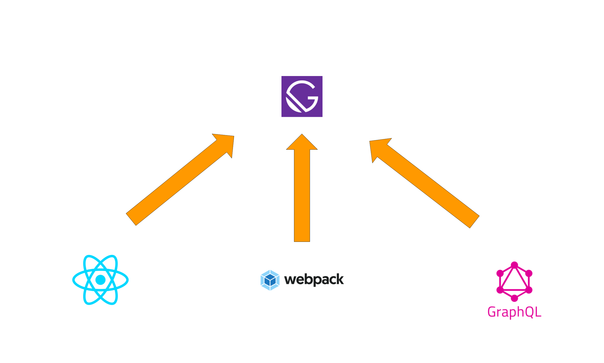
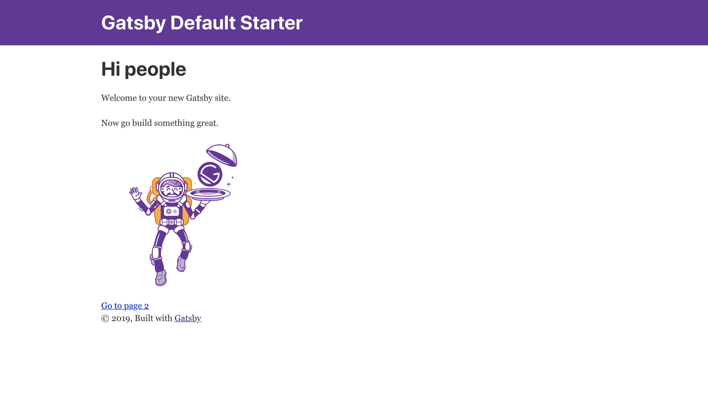
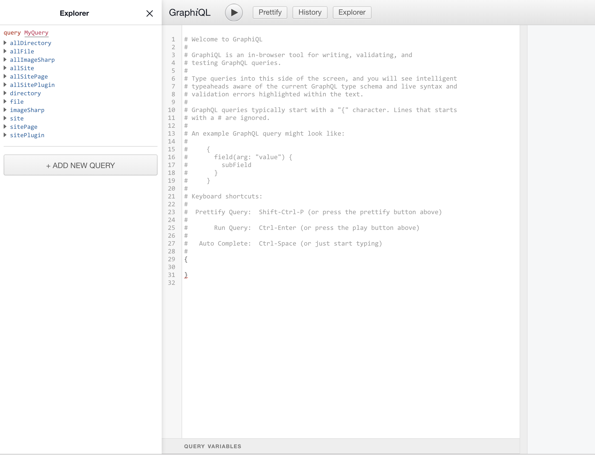

import { Appear, Head } from 'mdx-deck'
import { FullScreenCode, Invert, Split } from 'mdx-deck/layouts'
import { SocialIcon } from 'react-social-icons';
import { Image } from 'mdx-deck'
import { Notes } from 'mdx-deck'
import { themes } from 'mdx-deck'
import { LiveCode, LiveEditor } from 'mdx-deck-live-code';

export const theme = themes.future

<Head>
  <title>GatsbyJS at a glance</title>
  <meta itemprop="name" content="Presentation Title" />
  <meta itemprop="description" content="Presentation description" />
  <meta itemprop="image" content="https://pbs.twimg.com/profile_images/979408111868952576/yq2IUoGt_bigger.jpg" />
  <meta name="twitter:card" content="summary_large_image" />
  <meta name="twitter:site" content="@whoisryosuke" />
  <meta name="twitter:title" content="Presentation Title" />
  <meta name="twitter:description" content="Presentation description" />
  <meta name="twitter:image" content="https://pbs.twimg.com/profile_images/979408111868952576/yq2IUoGt_bigger.jpg" />
  <meta property="og:title" content="Presentation Title" />
  <meta property="og:type" content="article" />
  <meta property="og:url" content="http://www.example.com/" />
  <meta property="og:image" content="https://pbs.twimg.com/profile_images/979408111868952576/yq2IUoGt_bigger.jpg" />
  <meta property="og:description" content="Presentation description" />
  <meta property="og:site_name" content="Presentation Title" />
  <meta property="article:published_time" content="2013-09-17T05:59:00+01:00" />
  <meta property="article:modified_time" content="2013-09-16T19:08:47+01:00" />
  <meta property="article:section" content="Article Section (React? Design?)" />
</Head>


# Gatsby.JS at a glance
## by Avery Duffin

<a href="https://www.developerswholunch.com/talks">https://www.developerswholunch.com/talks</a>

<span style={{padding: 20 }}><SocialIcon url="http://twitter.com/DuffinAvery" /></span>
<span style={{padding: 20 }}><SocialIcon url="https://www.linkedin.com/in/avery-duffin-69317228/" /></span>
<span style={{padding: 20 }}><SocialIcon url="https://open.spotify.com/show/6AZJs6Bj1Ds2hWkPSHpObA?si=1d1TQGRKROSaY4Eg77z4Ww" /></span>
<span style={{padding: 20 }}><SocialIcon url="https://www.developerswholunch.com/" /></span>
<span style={{padding: 20 }}><SocialIcon url="https://github.com/averyduffin" /></span>
---

## What is


?

---



<Notes>
Gatsby combines React-based, GraphQL and webpack
static site generator
More like modern frameworks thatn a static site generator of old
</Notes>

---
Benefits
<ul>
<Appear>
    <li>preconfigured</li>
    <li>incredibly fast page loads</li>
    <li>service workers</li>
    <li>code splitting</li>
    <li>server-side rendering</li>
    <li>intelligent image loading</li>
    <li>asset optimization</li>
    <li>data prefetching</li>
    <li>JAMstack</li>
</Appear>
</ul>

---


---

## Easy Quickstart

```bash
npm install -g gatsby-cli
```
##### Create a new site
```bash
gatsby new gatsby-site
```
##### Change to the site folder
```bash
cd gatsby-site
```
##### Start dev server
```bash
gatsby develop
```

<Notes>
Easy CLI just like most programming languages
</Notes>

---

## Site page



---

## Graph QL query tool



###### http://localhost:8000/___graphql

---
<FullScreenCode>
<iframe src="https://codesandbox.io/embed/github/gatsbyjs/gatsby-starter-default/tree/master/?fontsize=14" title="gatsby-starter-default" allow="geolocation; microphone; camera; midi; vr; accelerometer; gyroscope; payment; ambient-light-sensor; encrypted-media; usb" style={{width:'100%', height:screen.height- 250, border:0, borderRadius: 4, overflow:'hidden'}} sandbox="allow-modals allow-forms allow-popups allow-scripts allow-same-origin"></iframe>
</ FullScreenCode>